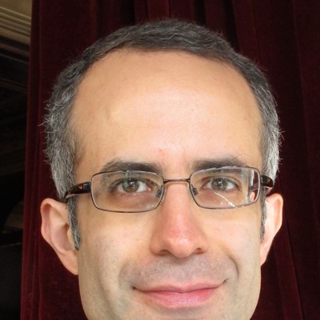

# People

## Mohsen Danaie

::::::{grid} 1 2 3 4

:::{anywidget} ./widgets/person-card.js
{
  "name": "Mohsen Danaie",
  "image": "images/people/DanaieMohsen.jpg",
  "popup_width": 420,
  "links": [
    {"label": "Email", "url": "mailto:mohsen.danaie@diamond.ac.uk"},
    {"label": "ePSIC", "url": "https://www.diamond.ac.uk/Instruments/Imaging-and-Microscopy/ePSIC/The-ePSIC-Team/Mohsen-Danaie.html"},
    {"label": "ORCID", "url": "https://orcid.org/0000-0002-9325-7571"},
    {"label": "Scholar", "url": "https://scholar.google.com/citations?user=0UheidQAAAAJ&hl=en"}
  ],
  "titles": [
    "Senior Electron Microscopy Scientist, ePSIC, Diamond Light Source"
  ],
  "bio": "I completed my PhD at the University of Alberta in 2010, on transmission electron microscopy of beam-sensitive Mg-based hydrides. I then held a postdoctoral position at McMaster University and the Canadian Centre for Electron Microscopy, working on phase transformations in Mg-Fe hydrides and on the relationship between alloy microstructure and corrosion in magnesium alloys. In 2014 I joined the atom probe tomography group in the Department of Materials at the University of Oxford, where I measured ion radiation damage in perovskite phases using aberration-corrected and in situ heating TEM, and carried out correlative TEM and atom probe characterisation of engineering alloys. My current work uses scanning electron nanobeam diffraction for statistical characterisation of engineering materials, combining automated analysis workflows with script-controlled data collection on the microscope."
}
:::

::::::

## Students

::::::{grid} 1 2 3 4

:::{anywidget} ./widgets/person-card.js
{
  "name": "Tom Liddy",
  "image": "images/people/LiddyTom.jpg",
  "popup_width": 420,
  "links": [
    {"label": "Email", "url": "mailto:thomas.liddy@diamond.ac.uk"},
    {"label": "ePSIC", "url": "https://www.diamond.ac.uk/Instruments/Imaging-and-Microscopy/ePSIC/The-ePSIC-Team/Tom_Liddy.html"},
    {"label": "Scholar", "url": "https://scholar.google.com/citations?user=Ira26iEAAAAJ&hl=en"}
  ],
  "titles": [
    "PhD Student, ePSIC and the Sustainable Hydrogen CDT, University of Nottingham"
  ],
  "bio": "Tom completed an integrated master's degree in Chemistry at the University of Nottingham in 2018, with research on the electrocatalytic activity of perovskites. He then studied fluid-rock interactions at the British Geological Survey until 2022, for geothermal, carbon capture and storage, and radioactive waste disposal applications. He now works within a collaboration between the Sustainable Hydrogen CDT and Diamond, producing metal nanoclusters as catalysts for ammonia decomposition and characterising them at ePSIC and beamline I09."
}
:::

::::::

## Former students

::::::{grid} 1 2 3 4

:::{anywidget} ./widgets/person-card.js
{
  "name": "Andy Bridger",
  "image": "images/people/placeholder.jpg",
  "popup_width": 420,
  "links": [
    {"label": "Scholar", "url": "https://scholar.google.com/citations?user=Qjlm5y8AAAAJ&hl=en"}
  ],
  "titles": [
    "University of Oxford"
  ],
  "bio": "Andy worked with us on automated domain mapping of scanning electron nanobeam diffraction datasets, using variational autoencoders and Bayesian statistics to segment 4D-STEM data. His research interests are inorganic chemistry, energy storage, diffraction techniques, and cathode materials."
}
:::

::::::

:::{div}
:class: msc-data-links

:::
